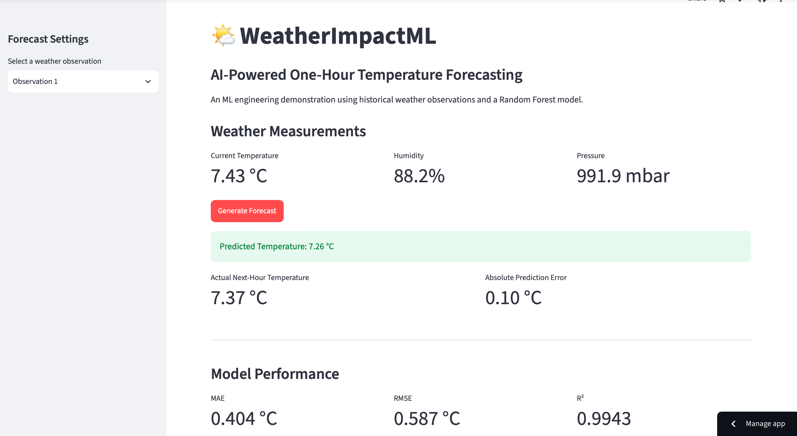
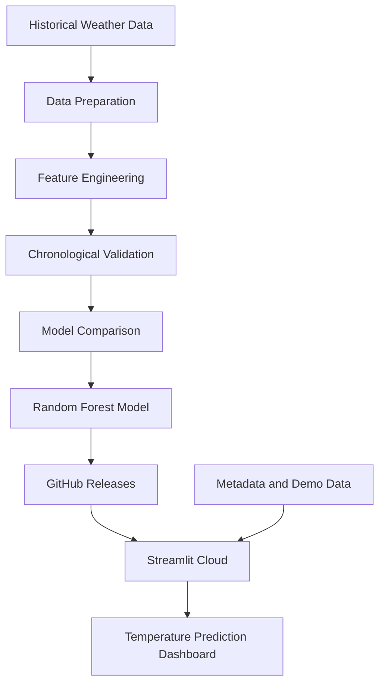

## Live Application Preview

# 🌤️ WeatherImpactML

### An End-to-End Machine Learning System for One-Hour Temperature Forecasting

**WeatherImpactML** is a machine-learning engineering project that predicts temperature one hour ahead using historical meteorological observations and a trained Random Forest regression model.

The project demonstrates the complete machine-learning lifecycle, including data preparation, feature engineering, model comparison, chronological validation, model serialization, API testing, and cloud deployment.

**Live Application:** https://weatherimpactml.streamlit.app

**GitHub Repository:** https://github.com/olohi184/WeatherImpactML

## 1. Project Overview

WeatherImpactML investigates the application of supervised machine learning to short-term temperature prediction using historical weather measurements.

The project uses the Jena weather dataset and incorporates meteorological variables and lagged temperature observations to estimate temperature one hour ahead.

The deployed Streamlit application allows users to select historical weather observations, generate predictions, and compare predicted temperatures with observed values.

**Note:** This is a historical-data research and educational demonstration, not a live operational weather forecasting service.

## 2. Machine Learning Methodology

The development pipeline consists of:

1. Historical weather data preparation and cleaning.
2. Feature engineering using temperature lags and meteorological variables.
3. Training and comparison of Linear Regression, Random Forest, and XGBoost models.
4. Chronological validation for model selection.
5. Final held-out test evaluation.
6. Model serialization using Joblib.
7. Prediction API testing with FastAPI.
8. Interactive dashboard development using Streamlit.
9. Deployment using GitHub and Streamlit Community Cloud.

## 3. Input Features

The model uses nine input features:

- Current temperature
- Atmospheric pressure
- Relative humidity
- Temperature lag 1
- Temperature lag 2
- Temperature lag 3
- Temperature lag 6
- Temperature lag 12
- Temperature lag 24

The prediction target is temperature one hour ahead, measured in degrees Celsius.

## 4. Model Comparison

Three regression algorithms were evaluated: Linear Regression, Random Forest, and XGBoost.

Random Forest was selected based on chronological validation performance, rather than relying exclusively on random train-test splitting.

| Model | Chronological Validation MAE (°C) |
|---|---:|
| Random Forest | 0.4246 |
| Linear Regression | 0.4375 |
| XGBoost | 0.4631 |

## 5. Final Model Performance

The selected Random Forest model achieved the following results on the held-out test dataset:

| Metric | Result |
|---|---:|
| Mean Absolute Error (MAE) | 0.404 °C |
| Root Mean Squared Error (RMSE) | 0.587 °C |
| R² Score | 0.9943 |
| Training samples | 59,471 |
| Test samples | 10,495 |

These results describe performance on the evaluated historical dataset and do not establish accuracy under all future weather conditions or geographic locations.

## 6. Application Features

The deployed application provides:

- Historical weather observation selection.
- Temperature, humidity, and pressure visualization.
- One-hour-ahead temperature prediction.
- Actual-versus-predicted temperature comparison.
- Absolute prediction error reporting.
- Model evaluation metrics.
- Automatic model retrieval from GitHub Releases.

## 7. Technology Stack

**Programming:** Python

**Machine Learning:** Scikit-learn, XGBoost, Pandas, NumPy

**Model Serialization:** Joblib

**API Development and Testing:** FastAPI

**Dashboard:** Streamlit

**Development Environment:** Google Colab

**Version Control:** GitHub

**Deployment:** Streamlit Community Cloud

## 8. Deployment Architecture

Historical Weather Data → Data Preparation → Feature Engineering → Model Training and Validation → Random Forest Model → GitHub Releases → Streamlit Dashboard → User Prediction

The trained model is distributed through GitHub Releases and loaded by the deployed application when required.

## 9. Reproducibility and Limitations

The repository provides the deployment application, model metadata, demonstration observations, dependencies, and a downloadable trained model.

The full training dataset and complete training notebook are not currently included in the deployment repository.

The current dashboard uses historical observations rather than real-time weather feeds. Its predictions should not be interpreted as operational weather forecasts.

## 10. Future Development

Potential extensions include:

- Real-time weather API integration.
- Additional geographic datasets.
- Model-drift monitoring.
- Uncertainty-aware predictions.
- Automated retraining.
- Model explainability and feature importance.
- Broader temporal and geographical generalization testing.

## 11. Project Leadership

**Olohimai Juliet Michael**

AI/ML Researcher | Systems Engineer | Principal Communication Engineer

Research interests include trustworthy artificial intelligence, robust machine learning, intelligent infrastructure, climate-aware prediction, and communications systems.

GitHub: https://github.com/olohi184

LinkedIn: https://www.linkedin.com/in/juliet-michael

## 12. License

This project is released under the MIT License.

---

**WeatherImpactML — From historical weather data to a deployed machine-learning application.**
